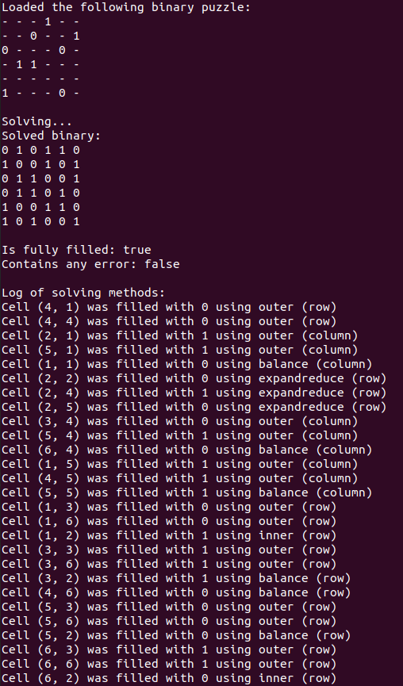
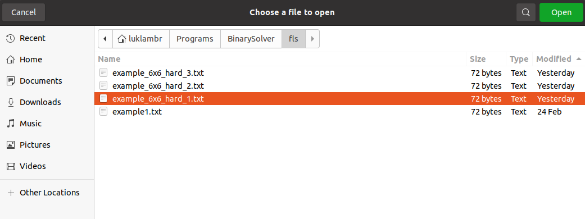
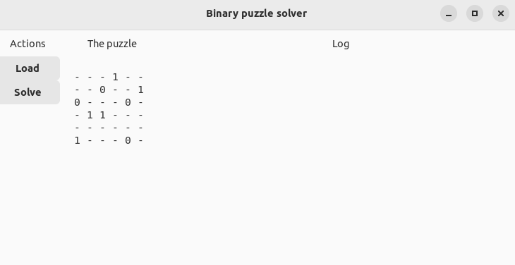
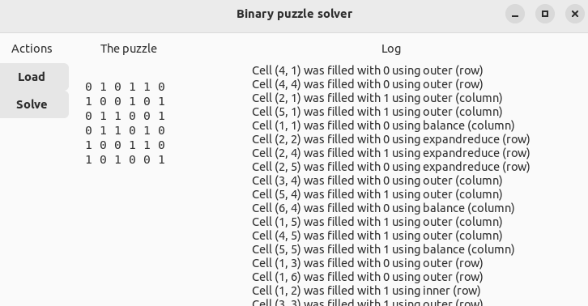

# Solver for binary puzzles

This is a simple solver for [binary puzzles](https://www.binarypuzzle.com/), written in the [Julia](https://julialang.org/) language.

### How to install
You will need the Julia programming language installed on your system. See [here](https://julialang.org/downloads/) for more information and instructions.
Next, clone this repository in a location of your choice using the following command:  
`git clone https://github.com/LukaLambrecht/BinarySolver.git`

For the graphical interface, you will additionally need the [Mousetrap](https://github.com/Clemapfel/Mousetrap.jl) package.
See [here](https://clemens-cords.com/mousetrap/01_manual/01_installation/) for installation instructions.
This is not needed for the command line interface.

### How to prepare a binary puzzle for solving
This program takes for its input a binary puzzle in `.txt` format.
The values on a single line should be separated by spaces, and the lines by a `newline` character.
Unknown values (i.e. empty cells in the original binary puzzle) should be indicated by the dash (`-`) character.
See the files in `BinarySolver/fls/` for examples on correct formatting.

### Tutorial
Inside the `BinarySolver` main directory, run the command `julia main.jl` with one additional argument, namely the path to the `.txt` file containing the binary puzzle in the format explained above.
So for example:  
`julia main.jl fls/example_6x6_hard_1.txt`  
This will produce the following output:

Alternatively, there is a (so far very minimalistic) graphical interface. Run the following command:  
`julia maingui.jl`  

This will make the following window pop up:

Press the `Load` button, and navigate to a binary puzzle in the suitable `.txt` format, as explained above. For example:

After pressing `Open`, the interface will look like this:

Next, press `Solve`, and the output will show like this:

### Solving methods
This program does not use guessing to solve the puzzles; it works essentially just like a person would.
The solving methods so far include:
* `outer`: `- 1 1 -` -> `0 1 1 0`
* `inner`: `1 - 1` -> `1 0 1`
* `balance`: if half of a line is already filled with `1`, all remaining entries are `0`, and vice versa.
* `expandreduce`: look for common patterns in all possible solutions of a line. 
For example, the line `1 1 0 - - -` does not yet have a unique solution, and cannot be solved further using the simple methods above.
Yet all solutions have in common that the last entry must be a `0` (as a `1` would necessarily produce a `0`-triplet preceding it).
Hence the line can be further solved to `1 1 0 - - 0`.

The iteration of these relatively simple methods over the rows and columns of a binary puzzle is sufficient to solve most of them.

### To do
* Find examples that cannot be solved with what is currently implemented, and find out what extra methods are needed.
* One rule that is not yet implemented is that all rows and all columns must be unique.
